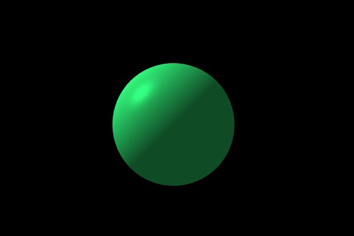

#  korender
[](https://maven-badges.herokuapp.com/maven-central/com.github.zakgof/korender)
[](http://kotlinlang.org)


Kotlin Multiplatform 3D graphics rendering engine based on OpenGL / OpenGL ES.

Korender uses declarative approach that seamlessly integrates 3D viewport into Compose Multiplatform UI. 
Same Korender code runs on all supported platforms.

````kotlin
@Composable
fun App() = Korender {
  Frame {
    Camera(DefaultCamera(Vec3(0f, 5f, 30f), -1.z, 1.y))
    Pass {
      Sky(sky(FastCloud))
      Renderable(standart(FixedColor) { color = Green }, mesh = sphere(2f), transform = translate(-0.5f.y))
    }
    Pass {
      Screen(effect(Water), sky(FastCloud))
      Billboard(effect(Fire) { yscale = 10f; xscale = 2f }, position = 6.y, transparent = true)
      Gui {
        Filler()
        Text(text = "FPS ${frameInfo.avgFps}", height = 50,  color = Red, font = "/ubuntu.ttf", id = "fps")
      }
    }
  }
}
````


Korender is BETA - any APIs may change without notice.

### Supported platforms
- Desktop (Windows/Linux) - based on LWJGL
- Android - based on OpenGL ES API

### Features
- Rendering opaque and transparent objects
- Diffuse, specular and ambient lighting (directional light)
- Projection shadow maps with percentage close soft shadows
- Texturing:
  - uv mapped
  - triplanar
  - detail
- Bump mapping
- Predefined and custom meshes
- Wavefront .obj model file loading
- Billboards (sprites)
- Batching (instancing)
- Simple heightfield (terrain)
- Textured or shader sky
- On-screen basic GUI
- Custom shaders support
- Multi-pass rendering and screen-space shaders (filters)
- Simple effects
  - smoke
  - fire
  - water

### Quick start

- Check out QuickStart application available at https://github.com/zakgof/korender/tree/main/quickstart

or, create an application from scratch:

- Generate a new KMP application using [Kotlin Multiplatform Wizard](https://kmp.jetbrains.com/). Select Android and Desktop platforms.
- Add Korender dependency `com.github.zakgof:korender:0.2.0`
- Add the above code to commonMain
- Run on desktop: `.\gradlew composeApp:run`


### Examples showcase app

- JVM Desktop Windows: https://github.com/zakgof/korender/releases/download/0.2.0/korender-demo-0.2.0.zip
- Android APK: https://github.com/zakgof/korender/releases/download/0.2.0/korender-demo-0.2.0.apk

[Examples source code](https://github.com/zakgof/korender/tree/main/korender-framework/examples/src/commonMain/kotlin)

### Further reading
Explore the [Korender Wiki](https://github.com/zakgof/korender/wiki)