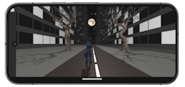
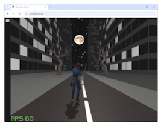
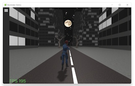
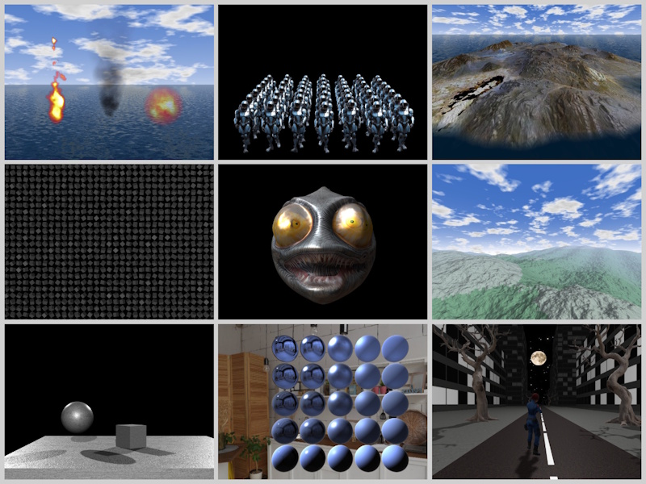

#  korender
[](https://central.sonatype.com/artifact/com.github.zakgof/korender/0.5.1)
[](http://kotlinlang.org)


Kotlin Multiplatform 3D graphics rendering engine based on OpenGL / OpenGL ES / WebGL.

Korender uses declarative approach that seamlessly integrates 3D viewport into Compose Multiplatform UI. 
Same Korender code runs on all supported platforms.



Live web demo: https://zakgof.github.io/projects/korender/wasm/

Korender is BETA - APIs may change without notice.

### Supported platforms
| Platform                | 3D API      |
|-------------------------|-------------|
| Desktop (Windows/Linux) | OpenGL 3.3  |
| Android                 | OpenGL ES 3 |
| Web                     | WebGL 2     |

### Features
- Physically Based Rendering (PBR) metallic-roughness model
- Directional and point lights
- Shadows: Variance shadow mapping (VSM), percentage-closer filter (PCF)
- Texturing with normal mapping support
- Predefined shapes and custom meshes
- Wavefront .obj and .gtlf/.glb file loading (with animation support)
- Billboards (sprites)
- Batching (instancing)
- Heightfield (terrain) rendering
- Textured or shader sky
- Environment mapping
- On-screen basic GUI
- Custom shaders support
- Multi-pass rendering and screen-space shaders (filters)
- Simple effects (water, smoke, fire)
- Deferred shading pipeline 

### Examples showcase app

#### Precompiled:
- [Web live demo](https://zakgof.github.io/projects/korender/wasm/)
- [JVM Desktop Windows](https://github.com/zakgof/korender/releases/download/0.5.0/korender-demo-0.5.0.zip)
- [Android APK](https://github.com/zakgof/korender/releases/download/0.5.0/korender-demo-0.5.0.apk)

[Examples source code](https://github.com/zakgof/korender/tree/main/korender-framework/examples/src/commonMain/kotlin)

#### Run locally:
- Web: `./gradlew :examples:wasmJsBrowserDevelopmentRun`
- Desktop: `./gradlew :examples:run`
- Android: `./gradlew :examples:installRelease`

!

### Quick start 

#### Code example

```kotlin
Korender {
  Frame {
    DirectionalLight(Vec3(1f, -1f, -1f))
    Renderable(
      base(
        color = ColorRGBA(0.2f, 1.0f, 0.5f + 0.5f * sin(frameInfo.time), 1.0f),
        metallicFactor = 0.4f
      ),
      mesh = sphere(2.0f),
      transform = translate(sin(frameInfo.time).y)
    )
  }
}
````
#### Quickstart application

- Check out QuickStart application available at https://github.com/zakgof/korender/tree/main/quickstart

#### From scratch

- Generate a new KMP application using [Kotlin Multiplatform Wizard](https://kmp.jetbrains.com/). Select Android, Desktop and WASM platforms.
- Add Korender dependency `com.github.zakgof:korender:0.5.1`
- Add the above code to commonMain
- Run on desktop: `./gradlew composeApp:run`


### Further reading
Explore the [Korender Wiki](https://zakgof.github.io/projects/korender/wiki)