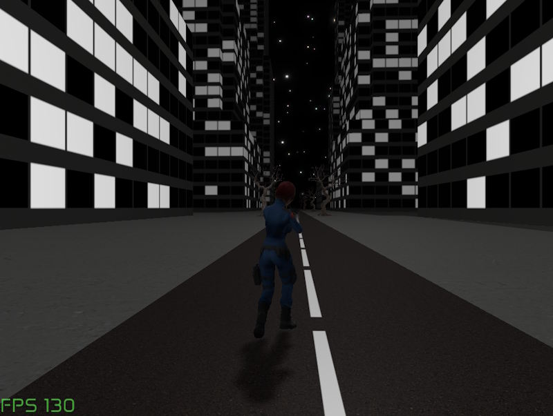

#  korender
[](https://maven-badges.herokuapp.com/maven-central/com.github.zakgof/korender)
[](http://kotlinlang.org)


Kotlin Multiplatform 3D graphics rendering engine based on OpenGL / OpenGL ES / WebGL.

Korender uses declarative approach that seamlessly integrates 3D viewport into Compose Multiplatform UI. 
Same Korender code runs on all supported platforms.



Live web demo: https://zakgof.github.io/projects/korender/wasm/

Korender is BETA - APIs may change without notice.

### Supported platforms
| Platform                                            | 3D API      |
|-----------------------------------------------------|-------------|
| Desktop (Windows/Linux)                             | OpenGL 3.3  |
| Android                                             | OpenGL ES 3 |
| Web  | WebGL 2     |
|                                                     |             |

### Examples showcase app

- Web live demo https://zakgof.github.io/projects/korender/wasm/
- JVM Desktop Windows: https://github.com/zakgof/korender/releases/download/0.4.0/korender-demo-0.4.0.zip
- Android APK: https://github.com/zakgof/korender/releases/download/0.4.0/korender-demo-0.4.0.apk

[Examples source code](https://github.com/zakgof/korender/tree/main/korender-framework/examples/src/commonMain/kotlin)

### Features
- Physically Based Rendering (PBR) metallic-roughness model 
- Rendering opaque and transparent objects
- Directional and point lights
- Shadows: Variance shadow mapping (VSM), percentage-closer soft shadows (PCSS) 
- Texturing with normal mapping support
- Predefined and custom meshes
- Wavefront .obj and .gtlf/.glb file loading 
- Billboards (sprites)
- Batching (instancing)
- Simple heightfield (terrain)
- Textured or shader sky
- On-screen basic GUI
- Custom shaders support
- Multi-pass rendering and screen-space shaders (filters)
- Simple effects
  - smoke
  - fire
  - water
- Deferred shading pipeline (experimental) 

### Quick start

```kotlin
Korender {
  Frame {
    DirectionalLight(Vec3(1f, -1f, -1f).normalize())
    Renderable(
      standart {
        baseColor = ColorRGBA(0.2f, 1.0f, 0.5f + 0.5f * sin(frameInfo.time), 1.0f)
        pbr.metallic = 0.4f
      },
      mesh = sphere(2.0f),
      transform = translate(sin(frameInfo.time).y)
    )
  }
}
````

- Check out QuickStart application available at https://github.com/zakgof/korender/tree/main/quickstart

or, create an application from scratch:

- Generate a new KMP application using [Kotlin Multiplatform Wizard](https://kmp.jetbrains.com/). Select Android, Desktop and WASM platforms.
- Add Korender dependency `com.github.zakgof:korender:0.4.0`
- Add the above code to commonMain
- Run on desktop: `.\gradlew composeApp:run`


### Further reading
Explore the [Korender Wiki](https://github.com/zakgof/korender/wiki)